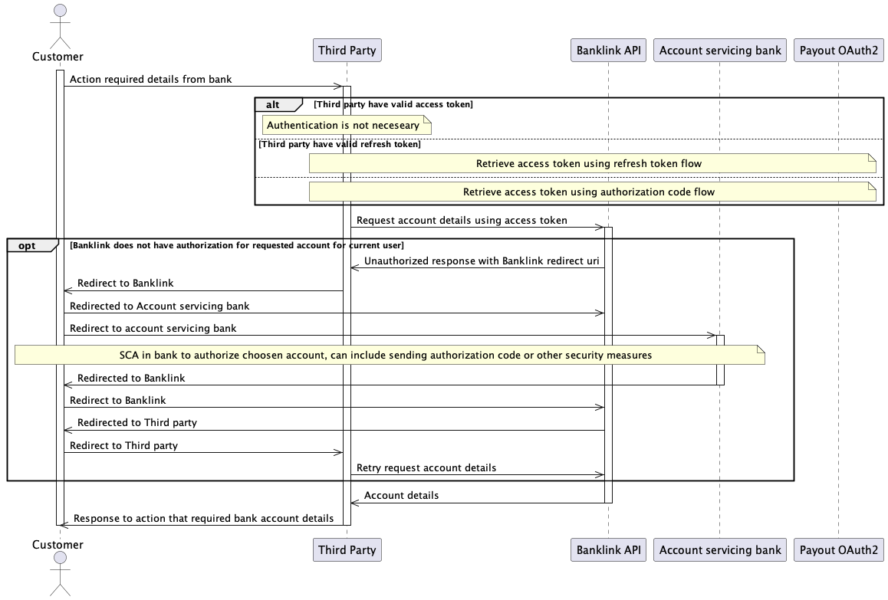

# Banklink API

Banklink API is service that allow to access user's bank information through unified API. This API is based on PSD2 API and is copying it to some extend, hovever it is limited by different standards and implementations by banks. This API can by accessed on behalf of user by receiving access token using [Payout OAuth2](./oauth2.md). Supported grant flows are `authorization_code` and `client_credentials`.

Integrator can use theses scopes:

| scope  | description                                                         |
|--------|---------------------------------------------------------------------|
| BLAISP | scope for reading details of user bank account                      |
| BLIBAN | to verify that currently authorized user has access to bank account |
| BLPISP | to create payment on behalf of current user                         |

Documentation for concrete endpoints:
- [production](https://documenter.getpostman.com/view/10478778/Uyr4KfHU)
- [sandbox](https://documenter.getpostman.com/view/10478778/Uyr4KLLY)

On next sequence diagram, we can see flow of calls, OAuth2 authorization code flow is omited since it is described in it's own [section](./oauth2.md), this diagram is for account details requests, but same flow will work for all other calls, besides call to list connected accounts, which does not request data from bank, onli shoving data from Banklink database, so there is no SCA between client and Bank:

Required scopes for OAuth2 are described in endpoint documentation.
