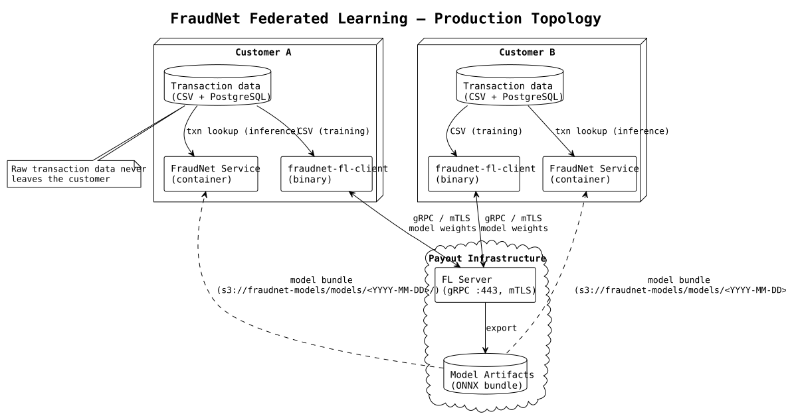
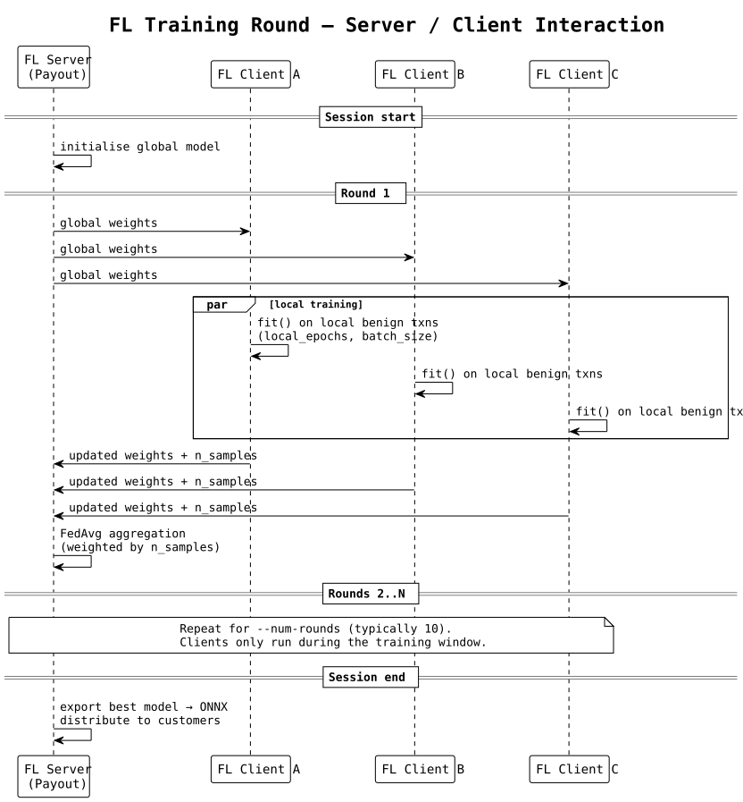
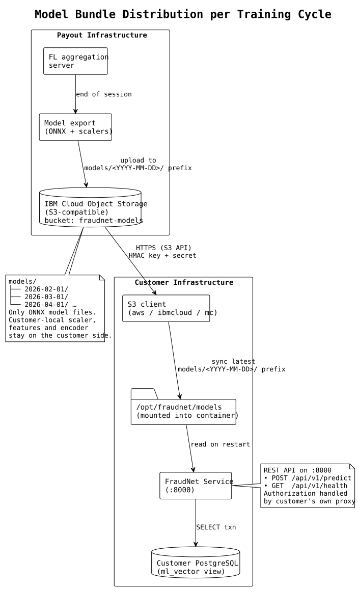
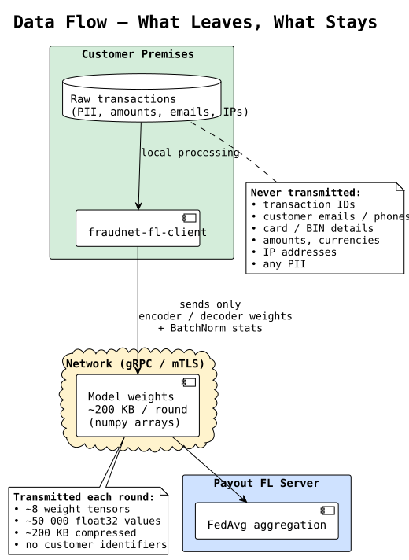

# FraudNet Federated Learning

FraudNet lets you participate in fraud model training without sharing raw transaction data. Your transactions never leave your infrastructure — only encrypted model weights are exchanged with Payout's aggregation server. Predictions are served locally by an inference container that you run on your own hardware.

This page is the end-to-end operator manual for both components:

| Component          | Role                                         | Format               | Runs where         |
|--------------------|----------------------------------------------|----------------------|--------------------|
| `fraudnet-fl-client` | Contributes to federated training (periodic) | Standalone binary    | Customer premises  |
| `fraudnet-service`   | Serves real-time fraud predictions           | OCI container archive| Customer premises  |
| FL aggregation server | Aggregates model updates across customers  | —                    | Payout infrastructure |



## Architecture at a glance

- **Federated training** runs in scheduled windows (weekly or monthly). Your client connects to Payout's FL server, trains locally on your CSV export, and sends back only model weights. The server averages updates across all participating customers and publishes an improved model.
- **Local inference** runs continuously inside the `fraudnet-service` container on your infrastructure. It reads individual transactions from your PostgreSQL database and returns a fraud probability over HTTP.
- **Model delivery**: after each training session Payout publishes the new ONNX model bundle to the `fraudnet-models` bucket on IBM Cloud Object Storage (S3-compatible). Each training month is a separate prefix, so older versions stay available for rollback or reproducibility. You pull the files with any S3 client using the read credentials issued per engagement.
- **Client binary and service container** are delivered by Payout when your engagement starts and whenever a new release is cut. They are not versioned through the `fraudnet-models` bucket.

> [!NOTE]
> The FL client and the service are two separate binaries. You do not need both running at once — the client only runs during training windows, the service runs continuously.

## Prerequisites

### Network

- Outbound gRPC to `fl.payout.one:443` during training windows. Staging uses `fl-staging.payout.one:443`.
- Outbound HTTPS to the IBM Cloud Object Storage endpoint (S3-compatible) for pulling model bundles from the `fraudnet-models` bucket.

### Hosts

- Linux host for the FL client. Binaries are built on **amd64** by default; **aarch64** builds are available on request.
- Linux host with Docker or Podman for the inference service.
- Optional GPU on the training host (CUDA is auto-detected; CPU-only training is supported).

### Data

- A CSV export of historical transactions for training. See [Input CSV schema](#input-csv-schema).
- A PostgreSQL database with the `ml_vector` view for live inference. See [Database setup](#database-setup).

### Credentials

- TLS root certificate for the FL server (provided by Payout).
- Your own mTLS client certificate + key pair, signed by the Payout CA. Required for production — the FL server will reject connections without a valid client certificate.
- An HMAC access key + secret for IBM Cloud Object Storage, scoped to read from the `fraudnet-models` bucket. (Payout issues these per engagement; IAM-based access is not offered.)

---

## Part 1: FL Client (training)



Training is **server-initiated and round-based**, not continuous. A session looks like this:

1. Payout starts the FL server at an agreed time.
2. You start your FL client and it connects to the server.
3. The server waits until all expected clients are online.
4. A fixed number of rounds runs (typically 10). Each round takes minutes.
5. The server exports the new model and the session ends — all clients exit.

### Installation

Download the archive provided by Payout and extract it to a stable location:

```bash
tar -xzf fraudnet-fl-client-<version>-linux-amd64.tar.gz \
    -C /opt/fraudnet/
chmod +x /opt/fraudnet/fraudnet-fl-client/fraudnet-fl-client
```

The binary is self-contained (~1.5 GB) and includes PyTorch, Flower, and all dependencies. No system Python is required.

> [!NOTE]
> Use `-linux-arm64.tar.gz` on aarch64 hosts. Request an aarch64 build from Payout if you do not already have one.

### Input CSV schema

The client reads a single CSV file containing historical transactions. Required columns:

| Column              | Type      | Example                 | Description                           |
|---------------------|-----------|-------------------------|---------------------------------------|
| `txn_id`            | string    | `TXN001`                | Unique transaction identifier          |
| `txn_status`        | string    | `1`                     | `1` = success, `2` = failed            |
| `amount`            | float     | `149.99`                | Transaction amount                     |
| `currency`          | string    | `EUR`                   | ISO 4217 currency code                 |
| `txn_inserted_at`   | timestamp | `2026-03-15 14:32:00`   | Transaction timestamp                  |
| `customer_id`       | string    | `CUST123`               | Customer identifier                    |
| `customer_email`    | string    | `john@example.com`      | Customer email                         |
| `account_id`        | string    | `ACC001`                | Merchant account ID                    |
| `payment_method_id` | int       | `1`                     | Payment method type                    |
| `fai_bin_country`   | string    | `SK`                    | Card-issuing country                   |
| `kinit_risk_status` | float     | `0.1`                   | Fraud label (see below)                |

Recommended columns (improve model accuracy if available):

| Column                 | Type      | Description                                 |
|------------------------|-----------|---------------------------------------------|
| `ac_phone`             | string    | Customer phone number                       |
| `fai_status_3ds`       | string    | 3DS outcome (`Y` / `N` / `U`)               |
| `fai_card_scheme`      | string    | Card brand (visa, mastercard, …)            |
| `checkout_products`    | json      | Product list with quantities                |
| `customer_inserted_at` | timestamp | Customer account creation date              |
| `payment_status`       | string    | Payment status                              |

**Fraud label (`kinit_risk_status`):**

- `0.1` — confirmed legitimate transaction
- `1.0` — confirmed fraud (chargeback, dispute, manual confirmation)

The autoencoder trains **only** on rows where `kinit_risk_status = 0.1`. Rows labelled `1.0` are used to compute validation metrics. The quality of federated training depends directly on the quality of your labels.

**Example CSV:**

```csv
txn_id,txn_status,amount,currency,txn_inserted_at,customer_id,customer_email,account_id,payment_method_id,fai_bin_country,kinit_risk_status
"TXN001","1",149.99,"EUR","2026-03-15 14:32:00","CUST123","john@example.com","ACC001",1,"SK",0.1
"TXN002","1",2500.00,"EUR","2026-03-15 15:00:00","CUST456","suspicious@temp.org","ACC001",2,"RU",1.0
"TXN003","2",29.99,"USD","2026-03-15 14:35:00","CUST123","john@example.com","ACC001",1,"CZ",0.1
```

### CLI reference

| Flag                   | Required         | Description                                                  |
|------------------------|------------------|--------------------------------------------------------------|
| `--server`             | yes              | FL server address in `host:port` form, e.g. `fl.payout.one:443` |
| `--csv-path`           | yes              | Path to the training CSV file                                |
| `--output-dir`         | yes              | Directory where the local scaler and logs will be written    |
| `--root-certificates`  | yes (production) | PEM file with the CA that signed the FL server certificate    |
| `--client-cert`        | yes (production) | PEM file with your client certificate                        |
| `--client-key`         | yes (production) | PEM file with the private key for the client certificate     |
| `--client-id`          | no               | Human-readable client identifier for server logs             |

> [!IMPORTANT]
> The production FL server requires mutual TLS. All three of `--root-certificates`, `--client-cert`, and `--client-key` must be supplied. A connection without a valid client certificate will be refused.

### Running the client

Production (mutual TLS — required):

```bash
/opt/fraudnet/fraudnet-fl-client/fraudnet-fl-client \
    --server fl.payout.one:443 \
    --csv-path /data/transactions.csv \
    --output-dir /var/lib/fraudnet/fl_output \
    --root-certificates /etc/ssl/payout-ca.pem \
    --client-cert /etc/ssl/fraudnet-client.pem \
    --client-key /etc/ssl/fraudnet-client.key \
    --client-id "customer-abc"
```

Integration testing (staging):

Payout operates a staging FL server at `fl-staging.payout.one:443` for customer integration tests. The staging endpoint is not always on — contact your Payout integration engineer to schedule a test window, during which a dedicated staging client certificate will be issued.

```bash
/opt/fraudnet/fraudnet-fl-client/fraudnet-fl-client \
    --server fl-staging.payout.one:443 \
    --csv-path /data/transactions.csv \
    --output-dir /var/lib/fraudnet/fl_output \
    --root-certificates /etc/ssl/payout-staging-ca.pem \
    --client-cert /etc/ssl/fraudnet-client-staging.pem \
    --client-key /etc/ssl/fraudnet-client-staging.key \
    --client-id "customer-abc-staging"
```

Use staging to validate the full path — network reachability, mTLS handshake, CSV schema, and your scheduler — before your first production session.

The client exits with a non-zero status code if the CSV fails validation, the connection fails, or the session is aborted. Log output is structured JSON on stdout.

### Scheduling

Run the client from your usual scheduler. It only runs during the training window — there is no daemon to keep alive between sessions.

```cron
# Weekly training, Sunday 02:00 local time
0 2 * * 0  /opt/fraudnet/fraudnet-fl-client/fraudnet-fl-client \
             --server fl.payout.one:443 \
             --csv-path /data/transactions.csv \
             --output-dir /var/lib/fraudnet/fl_output \
             --root-certificates /etc/ssl/payout-ca.pem \
             --client-cert /etc/ssl/fraudnet-client.pem \
             --client-key /etc/ssl/fraudnet-client.key
```

Payout schedules the FL server for the same window and notifies you of the time in advance. If your client does not connect before the server's `min_available_clients` timeout, the session continues without you — there is no penalty, but your data will not contribute to that round.

### Output

After a successful session, `--output-dir` contains the per-customer preprocessing artifacts that pair with the model you just helped train:

- `autoencoder_scaler.pkl` — StandardScaler fitted on your local data.
- `autoencoder_features.pkl` — feature-order metadata captured from your local pipeline.
- `onehot_encoder.pkl` — OneHotEncoder built from the categorical values present in your data.
- Structured logs for each round.

These files are **yours**. Payout never receives them and never redistributes them — customer data distributions (amount ranges, currency mixes, card-scheme coverage) vary, and each customer's preprocessing must match their own inputs.

> [!IMPORTANT]
> Always pair the preprocessing artifacts from a given training session with the model that session produced. Copy this directory into the path the inference service mounts at `/app/models` together with the ONNX model files pulled from object storage — don't mix preprocessing files from one session with a model from another.

---

## Part 2: FraudNet Service (inference)



The service is a FastAPI application that runs in a container on your infrastructure. It reads transactions from your own PostgreSQL database, runs the ONNX autoencoder + XGBoost pipeline locally, and returns a fraud probability.

### Obtaining the service container

The `fraudnet-service-<version>.tar.gz` OCI container archive (≈300 MB) and a matching `.env.example` template are provided by Payout at engagement start and on each release. Install it once, then refresh only when Payout ships a new version — most deployments do not upgrade the container between training cycles.

### Obtaining model bundles

After every federated training session Payout publishes the freshly aggregated model artifacts to the `fraudnet-models` bucket on IBM Cloud Object Storage. The bucket is S3-compatible, so any S3 client (`aws`, `s3cmd`, `mc`, the IBM Cloud CLI, or your own SDK) works — point it at the IBM COS endpoint given to you and authenticate with your HMAC access key + secret.

**What is in the bucket.** Only the shared neural-net / classifier files Payout produces centrally. The per-customer preprocessing artifacts (scaler, features metadata, one-hot encoder) are **not** in the bucket — they are produced by your own FL client and live in the client's `--output-dir`.

**Layout.** All keys live under the top-level `models/` prefix of the bucket, with one sub-prefix per training date (`YYYY-MM-DD`). Older prefixes remain available so you can roll back or reproduce a past prediction.

```
s3://fraudnet-models/models/
├── 2026-02-01/
│   ├── autoencoder_model.onnx
│   ├── autoencoder_model.onnx.data
│   └── classifier_head.onnx
├── 2026-03-01/
│   └── …
└── 2026-04-01/
    └── …
```

**Per-date files:**

- `autoencoder_model.onnx` — ONNX-exported autoencoder (use in production)
- `autoencoder_model.onnx.data` — external-weight data file referenced by the ONNX graph; must sit next to `autoencoder_model.onnx`
- `classifier_head.onnx` — ONNX-exported XGBoost classifier

Pull the latest date's models with the AWS CLI (any S3-compatible client works the same):

```bash
aws --endpoint-url https://s3.<region>.cloud-object-storage.appdomain.cloud \
    s3 sync s3://fraudnet-models/models/2026-04-01/ /opt/fraudnet/models/
```

Or with the IBM Cloud CLI:

```bash
ibmcloud cos object-get --bucket fraudnet-models \
    --key models/2026-04-01/autoencoder_model.onnx \
    /opt/fraudnet/models/autoencoder_model.onnx
```

Then copy the preprocessing artifacts (`autoencoder_scaler.pkl`, `autoencoder_features.pkl`, `onehot_encoder.pkl`) from the FL client's `--output-dir` into the same directory — see [Output](#output) in Part 1.

The file names on object storage follow the training pipeline's convention (`autoencoder_model.onnx`, …). The service's default env-var paths assume shorter names (`autoencoder.pt`, `classifier_head.json`), so either rename on copy or override `AUTOENCODER_PATH`, `XGBOOST_PATH`, `SCALER_PATH`, `ENCODER_PATH`, and `FEATURES_PATH` (see [Configuration](#configuration)) to point at the real files.

Restart the service container after swapping the model files so it picks up the new ones.

### Loading the container

```bash
# Podman
podman load -i fraudnet-service-<version>.tar.gz

# or Docker
docker load -i fraudnet-service-<version>.tar.gz
```

The command prints the reference of the loaded image — use that reference in the `run` command below. Optionally retag it to something local-friendly:

```bash
podman tag <loaded-reference> fraudnet-service:<version>
```

### Configuration

Create a `.env` file based on `.env.example`. The service reads the following variables (defaults shown):

| Variable              | Default        | Description                                                              |
|-----------------------|----------------|--------------------------------------------------------------------------|
| `DB_HOST`             | `localhost`    | PostgreSQL host                                                          |
| `DB_PORT`             | `5432`         | PostgreSQL port                                                          |
| `DB_DATABASE`         | `fraudnet`     | Database name                                                            |
| `DB_USERNAME`         | `fraudnet_predictor` | Read-only user with `SELECT` on `ml_vector`                        |
| `DB_PASSWORD`         | —              | **Required.** Password for `DB_USERNAME`.                                |
| `DB_SSLMODE`          | `require`      | One of `disable`, `allow`, `prefer`, `require`, `verify-ca`, `verify-full` |
| `DB_POOL_MIN_SIZE`    | `5`            | Minimum connections in the pool                                          |
| `DB_POOL_MAX_SIZE`    | `20`           | Maximum connections in the pool                                          |
| `MODEL_PATH`          | `./models`     | Directory containing the model bundle                                    |
| `SCALER_PATH`         | `./models/scaler.pkl`                | Override individual model paths if needed              |
| `AUTOENCODER_PATH`    | `./models/autoencoder.pt`            | Point to `.onnx` for production                        |
| `XGBOOST_PATH`        | `./models/classifier_head.json`      | Point to `.onnx` for production                        |
| `ENCODER_PATH`        | `./models/onehot_encoder.pkl`        |                                                         |
| `FEATURES_PATH`       | `./models/autoencoder_features.pkl`  |                                                         |
| `PORT`                | `8000`         | HTTP port                                                                |
| `HOST`                | `0.0.0.0`      | Bind address                                                             |
| `MAX_LOOKBACK_DAYS`   | `30`           | How far back to query customer history for feature engineering           |
| `PREDICTION_THRESHOLD`| `0.5`          | Probability cutoff for the `predicted_label` field in responses          |
| `REQUIRE_AUTH`        | `true`         | Set to `false` to disable the service's built-in auth check. Typical for customer-hosted deployments that place their own authorization (API gateway, reverse proxy, mesh policy) in front of the service. |
| `DEBUG`               | `false`        | Enables reload + debug logging                                           |

> [!IMPORTANT]
> In production, set `AUTOENCODER_PATH` and `XGBOOST_PATH` to the ONNX files. The ONNX runtime is ~250–330 MB smaller and 20–30 % faster than the PyTorch/XGBoost combination.

### Database setup

The service is schema-agnostic: it only ever reads from a single view named `ml_vector`. You own how that view is populated from your tables — your source schema will almost certainly differ from ours, so we do not ship a ready-made `ml_vector.sql`. You write the `SELECT` that maps your columns onto the contract below.

**View contract.** `ml_vector` must expose one row per transaction with the columns and types listed in the [Input CSV schema](#input-csv-schema), using the same column names. The only difference between training and inference:

- `kinit_risk_status` is **training-only** and is not required by the inference view.
- All other *required* columns from the CSV schema must be present on the view.
- *Recommended* columns, if you have them, improve prediction quality.

After you have defined the view, create a read-only user for the service:

```sql
CREATE USER fraudnet_predictor WITH PASSWORD 'change-me';
GRANT CONNECT ON DATABASE your_database TO fraudnet_predictor;
GRANT USAGE ON SCHEMA public TO fraudnet_predictor;
GRANT SELECT ON ml_vector TO fraudnet_predictor;
```

For acceptable latency on live traffic, make sure the underlying transaction table (call it `transactions`, `payments`, or whatever fits your schema) is indexed on the lookup columns the view uses. At minimum:

```sql
-- Replace "transactions" with your actual table name.
CREATE INDEX IF NOT EXISTS idx_transactions_txn_id
  ON transactions (txn_id);
CREATE INDEX IF NOT EXISTS idx_transactions_customer_date
  ON transactions (customer_id, txn_inserted_at);
```

### Running the service

```bash
docker run -d \
  --name fraudnet-service \
  --env-file /etc/fraudnet/fraudnet.env \
  -v /opt/fraudnet/models:/app/models:ro \
  -p 8000:8000 \
  fraudnet-service:<version>
```

Check that it came up:

```bash
curl http://localhost:8000/api/v1/health
```

Expected response:

```json
{
  "status": "healthy",
  "models_loaded": true,
  "database_connected": true
}
```

### Calling the prediction endpoint

The service does not ship with an opinionated authorization model. Run it with `REQUIRE_AUTH=false` and put your own authorization layer in front of it — an API gateway, reverse proxy, or service-mesh policy that terminates TLS and enforces whatever identity and scope model you already use.

```bash
curl -X POST http://localhost:8000/api/v1/predict \
  -H "Content-Type: application/json" \
  -d '{"txn_id": "123456"}'
```

Add your own `Authorization` header or other credentials at the proxy layer as required by your environment.

> [!IMPORTANT]
> Do not expose the service directly to the internet. It has no rate limiting or authorization when `REQUIRE_AUTH=false`; those controls are your responsibility.

Response:

```json
{
  "txn_id": "123456",
  "fraud_probability": 0.856,
  "predicted_label": 1,
  "reconstruction_error": 2.34,
  "processing_time_ms": 145.2
}
```

Expected latency is 100–300 ms per call: 20–50 ms database query, 50–150 ms feature engineering, 10–20 ms model inference.

For the full API reference — additional status codes, error payloads, and scope details — see [FraudNet API Documentation](/internal/fraud-prediction-service.md).

---

## End-to-end workflow

1. Receive the FL client binary, the service container archive, and the `fraudnet-models` bucket read credentials from Payout.
2. Install the client and the service as described above.
3. Define the `ml_vector` view in your database and provision a read-only user.
4. Export your historical transactions to the CSV schema for training.
5. Join the first scheduled training session — run the FL client during the window.
6. After the session, pull the latest per-date prefix from `s3://fraudnet-models/models/<YYYY-MM-DD>/` into the directory mounted as `/app/models`, and copy the preprocessing files (`autoencoder_scaler.pkl`, `autoencoder_features.pkl`, `onehot_encoder.pkl`) from the FL client's `--output-dir` into the same place.
7. Restart the service container so it picks up the new model files.
8. Verify `GET /api/v1/health` and a few `POST /api/v1/predict` calls.
9. Repeat steps 5–8 on each training cycle.

---

## Security & privacy



### What is transmitted

During training rounds the client sends only:

- encoder and decoder weight tensors
- BatchNorm running statistics
- a sample count per round

A typical round transmits ≈200 KB of compressed numeric data. No identifiers, amounts, emails, IPs, card numbers, or other PII are ever sent to Payout.

### Transport

- gRPC over **mutual TLS 1.3** to the FL server. The server authenticates to the client via the Payout CA; the client authenticates to the server via a certificate signed by the Payout CA and pinned to your engagement.
- The service-side inference API on your own infrastructure should be fronted by your existing TLS termination and OAuth2 infrastructure.

### Data sovereignty

The `scaler.pkl` produced by the client is fitted on your local data. This is by design — it keeps local distributions (transaction amount ranges, currencies, etc.) private while still contributing to a shared global model. Because the scaler is per customer, scalers and models are not interchangeable between customers.

---

## Troubleshooting

| Symptom                                           | Likely cause / fix                                                                                   |
|---------------------------------------------------|------------------------------------------------------------------------------------------------------|
| Client exits with "CSV validation failed"          | A required column is missing or a timestamp does not parse. Cross-check [Input CSV schema](#input-csv-schema). |
| Client fails to connect (gRPC: unavailable)        | Firewall is blocking outbound to `fl.payout.one:443`, or the training window has not started.        |
| Client fails TLS handshake                         | Wrong `--root-certificates`, missing or expired `--client-cert` / `--client-key`, or clock skew on the host. |
| "insufficient benign samples" error                | Your CSV has too few `kinit_risk_status = 0.1` rows. Export a longer history.                        |
| Service `models_loaded: false` in health check     | A file listed in the model paths is missing or unreadable. Check the container's `/app/models` mount.|
| Service `database_connected: false`                | `DB_*` variables, network reachability, or `ml_vector` permissions. Run `\dv ml_vector` as the predictor user. |
| Slow predictions (>500 ms)                         | Missing indexes on your transaction table, or a single customer has > 1000 transactions in the lookback window. |
| 401 / 403 on `/api/v1/predict`                     | Rejected by your fronting API gateway or reverse proxy, not by the service itself. Check the proxy's access logs and policy configuration. |

For anything not on this list, collect the service logs and the client's stdout and contact your Payout integration engineer.
