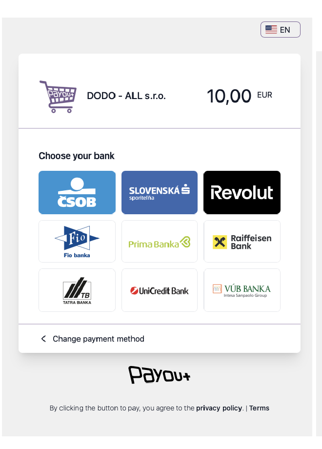
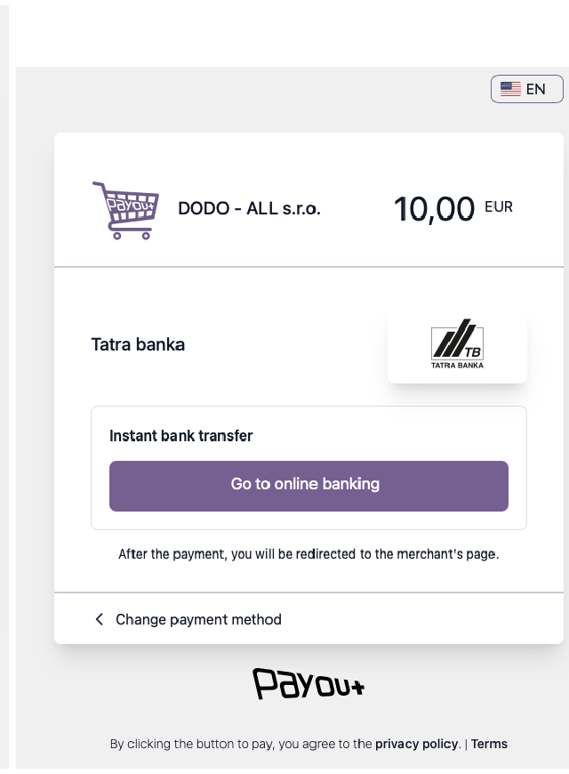
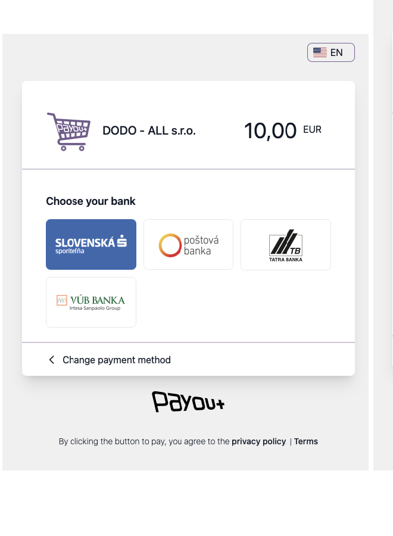
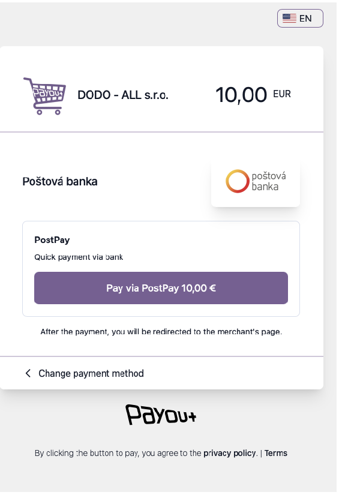
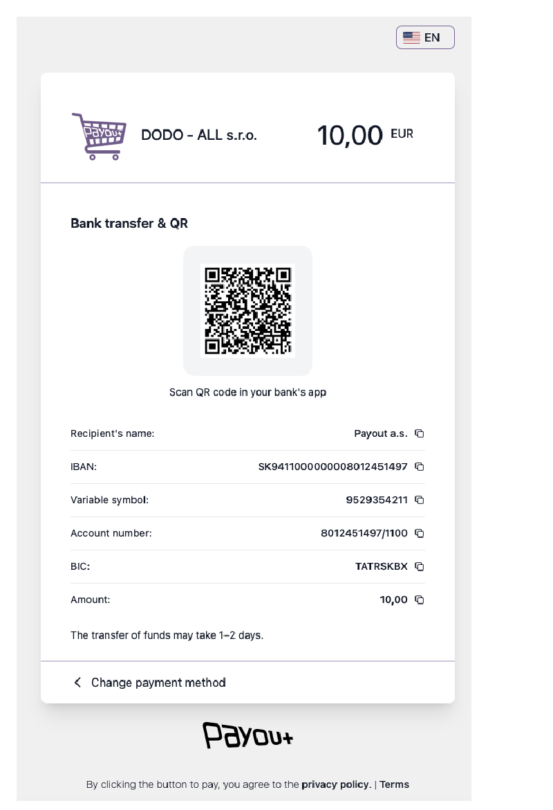

# Checkout payment methods

There are two ways to direct a customer to a specific payment method within Payout Checkout.

## A. Appending a parameter to the URL

1. **Get the checkout URL**
   * Obtain the `checkout_url`, e.g. from the procedure indicated in [Simple Payment](https://developers.payout.tech/#/use-cases/simple-payment) in points 3 and 4.

2. **Append the `payment_method` query parameter** to the obtained URL using one of the supported identifiers (see below).

   Example:
   ```
   https://sandbox.payout.one/checkouts/[token]/?payment_method=tatra_pay
   ```

## B. Specifying the method during payment creation

You can define a specific method directly when calling the [Create checkout](https://developers.payout.tech/#/apis?id=create-checkout) endpoint.

* Add the `payment_method` parameter to the JSON request body using one of the supported identifiers.

## Overview of supported values for `payment_method`

> **Method availability:** The list of methods you can successfully use depends on your contract and settings within the Payout system. If an incorrect or unsupported value is provided, the customer will be shown the standard selection of all available methods.

### 1. Cards and digital wallets

| Identifier   | Description    |
|--------------|----------------|
| `card`       | Payment card   |
| `apple_pay`  | Apple Pay      |
| `google_pay` | Google Pay     |

### 2. Instant bank transfers (PIS)

`pisp` – Selection of available banks within PIS.

 

Specific banks (customer is redirected directly to the selected bank):

| Identifier            | Bank                       | Currency |
|-----------------------|----------------------------|----------|
| `pisp-slsp`           | Slovenská sporiteľňa       | EUR      |
| `pisp-vub`            | VÚB banka                  | EUR      |
| `pisp-tatrabanka`     | Tatra banka                | EUR      |
| `pisp-csob`           | ČSOB                       | EUR      |
| `pisp-unicredit`      | UniCredit Bank             | EUR      |
| `pisp-primabanka`     | Prima banka                | EUR      |
| `pisp-raiffeisen`     | Raiffeisen bank            | EUR      |
| `pisp-fio`            | Fio banka                  | EUR, CZK |
| `pisp-revolut`        | Revolut                    | EUR      |
| `pisp-csas`           | Česká spořitelna           | CZK      |
| `pisp-komercni-banka` | Komerční banka             | CZK      |
| `pisp-csob-cz`        | ČSOB CZ                    | CZK      |
| `pisp-air-bank`       | Air Bank                   | CZK      |
| `pisp-moneta`         | Moneta Money Bank          | CZK      |
| `pisp-raiffeisen-cz`  | Raiffeisenbank CZ          | CZK      |

### 3. Bank buttons

`bank_button` – List of banks with available payment via bank button.

 

Specific banks (customer is redirected directly to the bank):

| Identifier   | Bank                          |
|--------------|-------------------------------|
| `evub`       | ePlatby VÚB                   |
| `tatra_pay`  | TatraPay                      |
| `sporo_pay`  | SporoPay                      |
| `post_pay`   | PostPay (Poštová banka)       |
| `unicredit`  | UniCredit *(currently unavailable)* |

### 4. Manual bank transfer

| Identifier      | Description    |
|-----------------|----------------|
| `bank_transfer` | Display of complete payment details (IBAN, amount, variable symbol) including a QR code for convenient payment (displayed according to your settings). |


