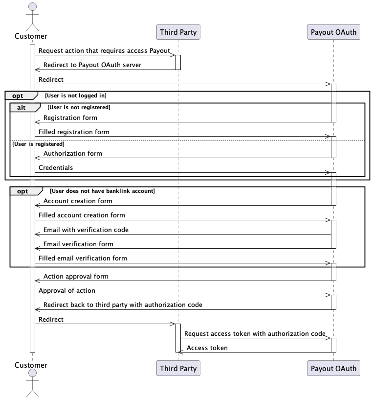

# Banklink API accounts

From user point of view, process is different for issuing access token for [Banklink](./banklink.md). In this case it is also required to have banklink account. In case he does not have it, he is requested to create one as intermediate step betwen login/registration and granting access to his account to integrator. Sequence diagram which includes account creation can be seen next:

