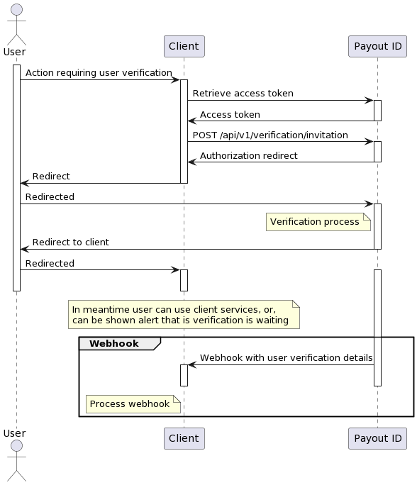

# Identity verification and AML

   > [!NOTE]
   > This API is still heavily developed and can change in next release

PayoutID also provides identity verification and AML. It is implemented using OAuth2
authorization code flow. It can be done special scopes in authorization redirect.
When `require_document` scope is used, during authorization
user is verified livenes check and AML data retrieved about him.
To be able to retrieve those details, `identity-doc-aml` scope needs to be also present.
Client can then retrieve user details and AML information using PayoutID Identity API.

Whole client flow can be seen on following diagram:

