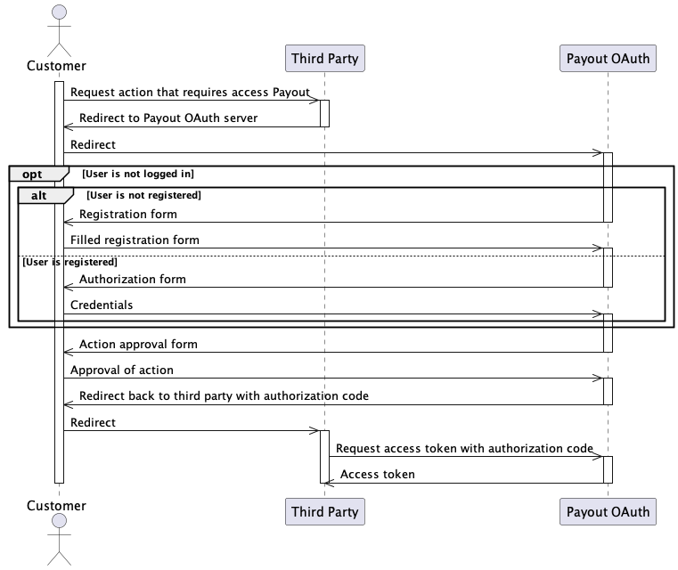

# PayoutID OAuth

Supported grants are:
- [authorization code grant](https://www.oauth.com/oauth2-servers/server-side-apps/authorization-code/)
- [refresh token grant](https://www.oauth.com/oauth2-servers/making-authenticated-requests/refreshing-an-access-token/)
- [client credential grants](#client-credentials-grant)

## Authorization code grant

In this code grant, when integrator need to receive some data or do any action on behalf of user. He needs first to redirect him to authorization url. There are separate url's for each environment:

 - https://id-sa.payout.one/oauth - for sandbox environment
 - https://id.payout.one/oauth - for production environment

Authorization flow is going as follow:

1. User need to be redirected to authorization endpoint:
  * for sandbox [https://documenter.getpostman.com/view/10478778/2sA3dvmDNN#fe79dd38-1fc0-41ff-b1b8-906bc717d8a1](https://documenter.getpostman.com/view/10478778/2sA3dvmDNN#fe79dd38-1fc0-41ff-b1b8-906bc717d8a1)
  * for production [https://documenter.getpostman.com/view/10478778/2sA3dvmDNM#a1081bb8-ece5-4c7e-b738-ee967e9e74d1](https://documenter.getpostman.com/view/10478778/2sA3dvmDNM#a1081bb8-ece5-4c7e-b738-ee967e9e74d1)
2. User needs to authenticate self (login or register) and then is asked to approve access to requested scopes to integrator. Possible scopes are descriped in concrete endpoints required them.
3. User is redirected back to integrator with `authorization_code` in query parameters.
4. Integrator uses `authorization_code` to retrieve `access_token` using token endpoint:
  * for sandbox [https://documenter.getpostman.com/view/10478778/2sA3dvmDNN#ca10be90-301b-4ffd-9899-009dd730852d](https://documenter.getpostman.com/view/10478778/2sA3dvmDNN#ca10be90-301b-4ffd-9899-009dd730852d)
  * for production [https://documenter.getpostman.com/view/10478778/2sA3dvmDNM#99227b26-7449-4a63-93b6-08fe5b81ae2d](https://documenter.getpostman.com/view/10478778/2sA3dvmDNM#99227b26-7449-4a63-93b6-08fe5b81ae2d)
5. Integrator now can work with chosen endpoint passing `access_token` in `Authorization` header.

This flow also can be seen at next diagram:

## Refresh token grant

Authorization code is time constrained. For security reason, expiration times are short and should not be longer that one hour. To allow for longer access to resource, refresh token is issued with every authorization code access token which can have expiration time up to 90 days. Hovever, it is not alloweed to access endpoints with this token and only can be used to issue new `access_token`.

This token is issued by passing `refresh_token` as `grant` and retrieved refresh token as `refresh_token` to `token` API:
  * for sandbox [https://documenter.getpostman.com/view/10478778/2sA3dvmDNN#ca10be90-301b-4ffd-9899-009dd730852d](https://documenter.getpostman.com/view/10478778/2sA3dvmDNN#ca10be90-301b-4ffd-9899-009dd730852d)
  * for production [https://documenter.getpostman.com/view/10478778/2sA3dvmDNM#99227b26-7449-4a63-93b6-08fe5b81ae2d](https://documenter.getpostman.com/view/10478778/2sA3dvmDNM#99227b26-7449-4a63-93b6-08fe5b81ae2d)

## Client credentials grant

In some cases, integrator can use this grant to access resources without consent from user in IS Payout. In cases where user need to authenticate resources from different service provider, for instance Bank, authentication on service provider might still be required. In case of this grant, integrator can directly request token with his `client_id` and `client_secret`. No authorization code is required. 
