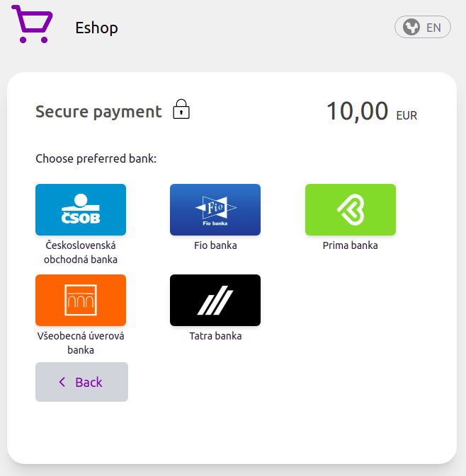
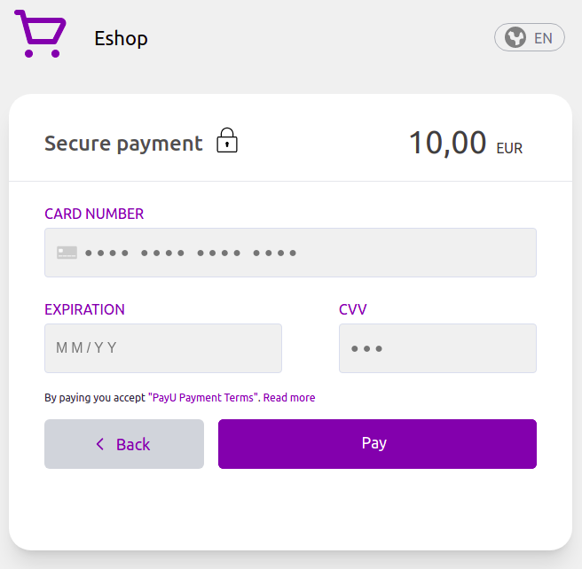
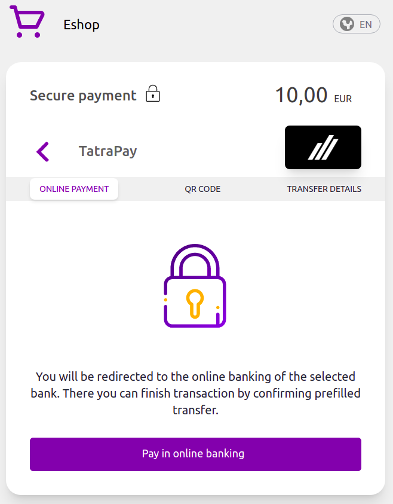

# Checkout payment methods

## Show a specific payment method in the checkout

1. Get checkout url
   * It is necessary to obtain the checkout_url, e.g. from the procedure indicated in the [Simple Payment](https://developers.payout.tech/#/use-cases/simple-payment) in points 3 and 4.   

2. Add the selected_group parameter
   * Add the selected_group url parameter to the checkout url bank or card
   * Supported identificators:
     - card
     - bank
   * Add selected_bank_group with selected_group=bank to show specific bank, value for selected_bank_group is SWIFT code of the bank
   * Examples:

    1. Show bank list:
    ```
    https://test.payout.one/checkouts/U0ZNeU5UWS5nMmdEZEFBQUFBSmtBQU5oY0dsaElXUUFBbWxrWWdBQ0tJZHVCZ0JtS1hrTGZnRmlBQUZSZ0EuR2xYdDlsZjY4NDNIY2xaUXFXTFBGdHFETWZDNmw3SXViOG1wM0VXYi1nOA/?selected_group=bank
    ```

    

    2. Show card payment:
    ```
    https://test.payout.one/checkouts/U0ZNeU5UWS5nMmdEZEFBQUFBSmtBQU5oY0dsaElXUUFBbWxrWWdBQ0tJZHVCZ0JtS1hrTGZnRmlBQUZSZ0EuR2xYdDlsZjY4NDNIY2xaUXFXTFBGdHFETWZDNmw3SXViOG1wM0VXYi1nOA/?selected_group=card
    ```

    

    3. Show a specific bank:
    ```
    https://test.payout.one/checkouts/U0ZNeU5UWS5nMmdEZEFBQUFBSmtBQU5oY0dsaElXUUFBbWxrWWdBQ0tJZHVCZ0JtS1hrTGZnRmlBQUZSZ0EuR2xYdDlsZjY4NDNIY2xaUXFXTFBGdHFETWZDNmw3SXViOG1wM0VXYi1nOA/?selected_group=bank&selected_bank_group=TATRSKBX
    ```

    

## Redirect to specific payment method

1. Get checkout url
   * It is necessary to obtain the checkout url, e.g. from the procedure indicated in the [Simple Payment](https://developers.payout.tech/#/use-cases/simple-payment) in points 3 and 4.   

2. Add the payment_method parameter
   * Add the payment_method url parameter to the checkout url, with one of the supported payment methods identificators
   * Supported identificators:
      - evub
      - tatra_pay
      - sporo_pay
      - post_pay
      - unicredit
   * If identificator sent in query parameter is invalid, or is not supported the customer will be redirected to regular checkout form.

    Example url:
    ```
    https://test.payout.one/checkouts/U0ZNeU5UWS5nMmdEZEFBQUFBSmtBQU5oY0dsaElXUUFBbWxrWWdBQ0tJZHVCZ0JtS1hrTGZnRmlBQUZSZ0EuR2xYdDlsZjY4NDNIY2xaUXFXTFBGdHFETWZDNmw3SXViOG1wM0VXYi1nOA/?payment_method=tatra_pay
    ```

3. Redirect to payment method
    * After redirecting to the checkout url with the added payment_method parameter, the redirect will take place directly to the  selected payment method without displaying the checkout form
