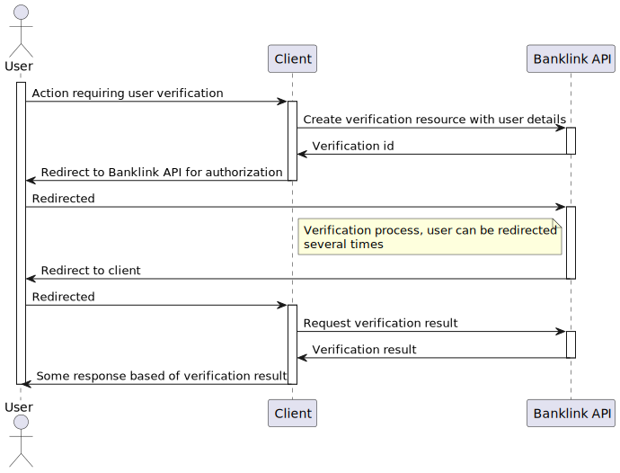

# Verification

This service is protected using our [OAuth2 authorization server](./payout-id.md)
and requires scope `VERIFY`, this scope should be retrieved using
`client credentials` flow.

There is endpoint in banklink API to verify user identity using
bank account details. Some integration's don't send us account
owner details, in that case we only verify that user have access
to bank account. Calls for this use case are described
in Banklink API verification collection:

- [production](https://documenter.getpostman.com/view/10478778/Uyr4KfHU#2609a1b2-1df4-41c8-bf12-aec1f9553a15)
- [sandbox](https://documenter.getpostman.com/view/10478778/Uyr4KLLY#f5e0ad5a-7175-48e2-a8a4-a95cd62137fe)

To verify user identity it is necessary first to create
verification resource with user name.

As a result of create verification call, you will get in
response `redirect_url`. You should then proceed by adding `redirect_url`
and optionally `state` query parameters to this link and redirect user to it.

After user gave read only access to his bank account,
he is redirected back to your app. Result of verification can be retrieve
using verification details endpoint using verification id received in
response from verification creation call.

Whole flow is represented on following diagram:

Verification can end up in one of these statuses:

- `verified_access` - user managed to provide credentials for account, but bank servicing that account is not providing ownership information
- `verified_ownership` - user managed to login and account servicer provided ownership information which also matched name of the user
- `unverified_access` - user failed to provide credentials to access account
- `unverified_ownership` - user provided credentials to access account but ownership details were different from provided user details
- `error` - error during communication between us and account servicer
